# Agencia de viajes
****
**Los recursos de tanto de la base de datos cómo de los endPoints del postman está:** 
**La base de datos están el src/resource/Data_Base**
**La colección d[src](src)e endPoints de postman está en la src/resource/Postman.**

**Credenciales para el empleado:**<br>
**- Usuario: hackaboss**<br>
**- Contraseña: 1234**
***

Aplicación que simula la creación de una agencia de viajes, la cual controla la creación de hoteles,
vuelos y reservas de los mismos. En este caso según el enunciado se crea un hotel por tipo de habitación,
que quiere decir esto, que si hay de un hotel 3 tipos de habitaciones (individual, doble y triple), se tendrá 
que crear 3 hoteles con códigos diferentes.

Por otro lado, los vuelos se crean solo de ida, si el usuario quiere otro vuelo de vuelta, tendrá que 
crear otro con otro código diferente al de ida con los nuevos datos de la reserva.


# Explicación de la aplicación
***
## EndPoints (APIs)

En este apartado voy a ir haciendo una breve explicación de lo que va haciendo cada api o endpoints.

## Hoteles
****
## EndPoints:

### Método POST (Este método tiene que estar autenticado el empleado)
***

> http://localhost:8080/agency/hotels/new

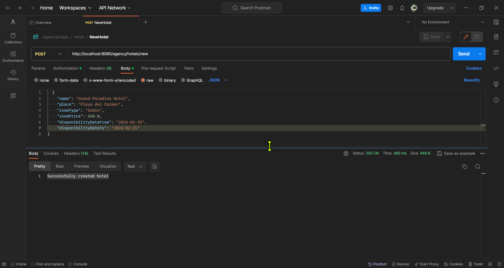


En este endpoint lo que vamos hacer es básicamente crear los hoteles con esta request:

```json
  {
        "name": "Grand Paradise Hotel",
        "place": "Playa del Carmen",
        "roomType": "Doble",
        "roomPrice": 550.0,
        "disponibilityDateFrom": "2024-02-20",
        "disponibilityDateTo": "2024-02-25"
    }
```

En este caso como he comentado anteriormente, creamos un hotel por habitación, esto qué quiere decir, 
pues que en la request también irán los datos de dicha habitación, así cuando creemos el hotel,
los datos irán a cada una de usas tablas en la base de datos.

y la response de dicha request es:

> Successfully created hotel

### Método GET (Listar todos los hoteles)
***

Este método es muy sencillo y muy práctico de cara al usuario y también para el empleado, ya que
podremos ver cuantos hoteles están reservardos y cuantos no.

> http://localhost:8080/agency/hotels

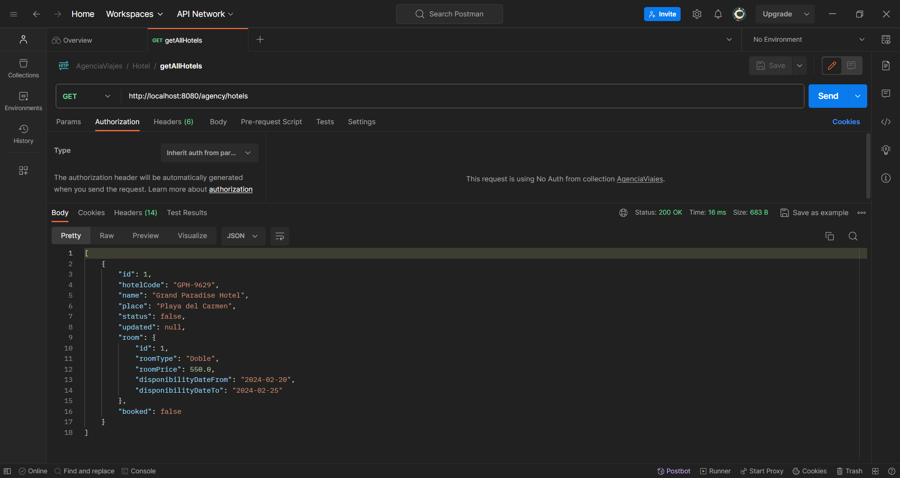

Si por un causal no hubiera ningún hotel, es decir, o que no lo hemos agregado o simplemente es que lo hemos eliminado
no saldrá un error cómo este:

>There are no hotels in the database


### Método GET (Listar los hoteles en un determinado rango de fechas, lugar y buscar por disponibilidad)
***

En este método como bien dice el enunciado, nos va a devolver los hoteles que se encuentren en la franja de fechas que nosotros
le hayamos introducido a parte de indicar si está disponible y el lugar del hotel al que queremos viajar.

El error que nos puede salir si no hay hoteles con los criterios que queremos es:

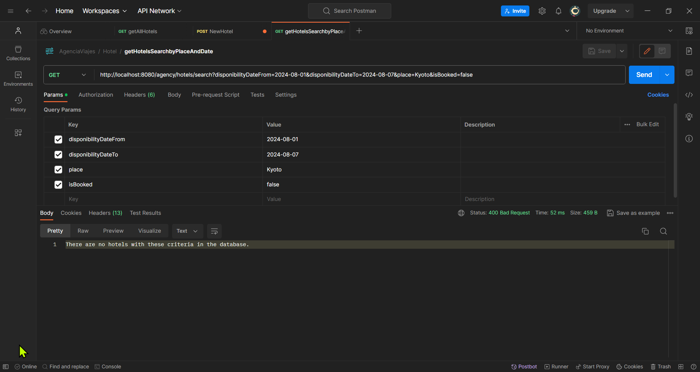

Pero si por el caso si hubiera algún hotel u hoteles disponible:

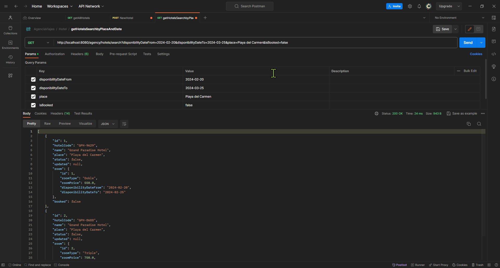

Y nos devolvería el listado por los criterios que hemos indicado

### Método GET por ID.
***

>http://localhost:8080/agency/hotels/2

Este método simplemente es buscar hoteles por el ID y de devuelve un hotel y en el caso de que no exista el hotel nos dará un error:

Hotel válido:

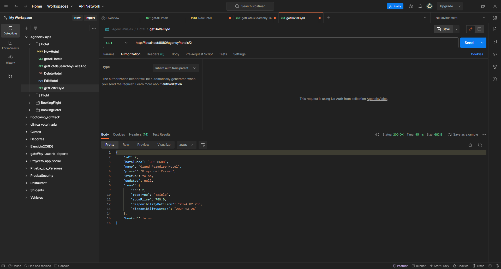

Hotel no válido:

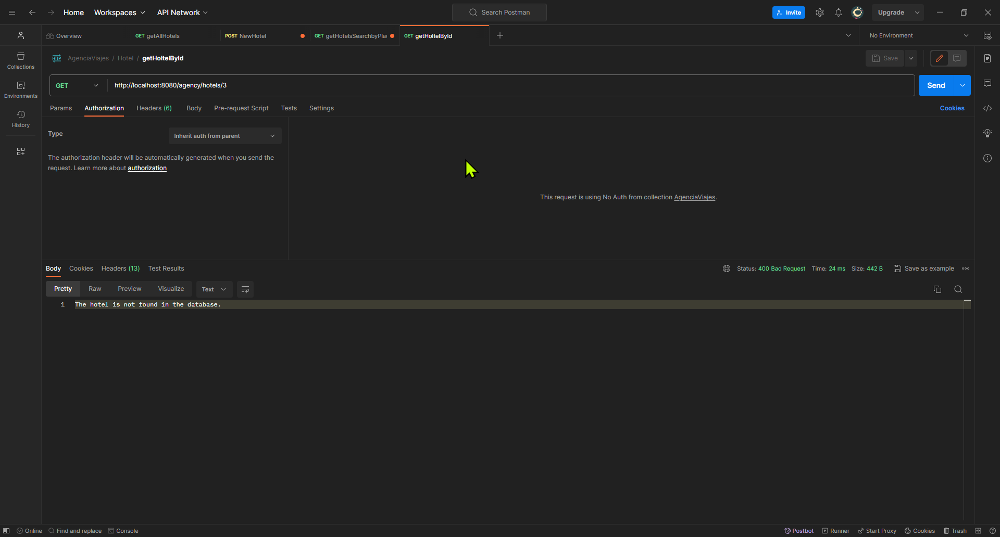
Nos sacaría un error de que ese hotel no existe en la base de datos.

### Método PUT. Actulizar el hotel.
***

**Este método el empleado tiene que estar autenticado**

En mi caso sólo podremos actualizar el nombre y el lugar de procedencia del hotel, a parte 
la actualización se crea a través del ID que queremos actualizar, si por el hipotético caso 
nos equivocamos de id, nos saltará un error.

```json
{
  "name": " Hotel Francesco",
  "place": "Florencia"
}
```

Actualizar hotel no válido:

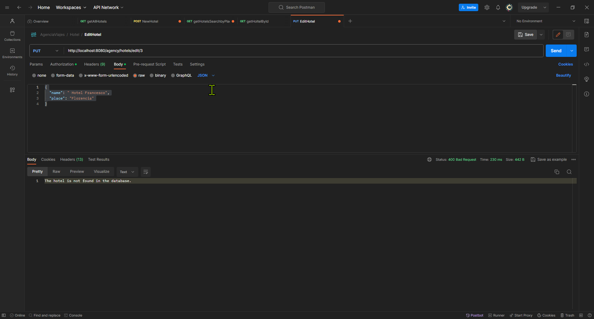

En el caso de que se pueda actualizar el hotel, se nos actualizará el nombre y el lugar de procedencia, como en un 
principio dijimos que el código del hotel son las primeras letras del nombre y 4 números aleatorios, eso también se nos 
cambiará, ya que cambiamos el nombre.

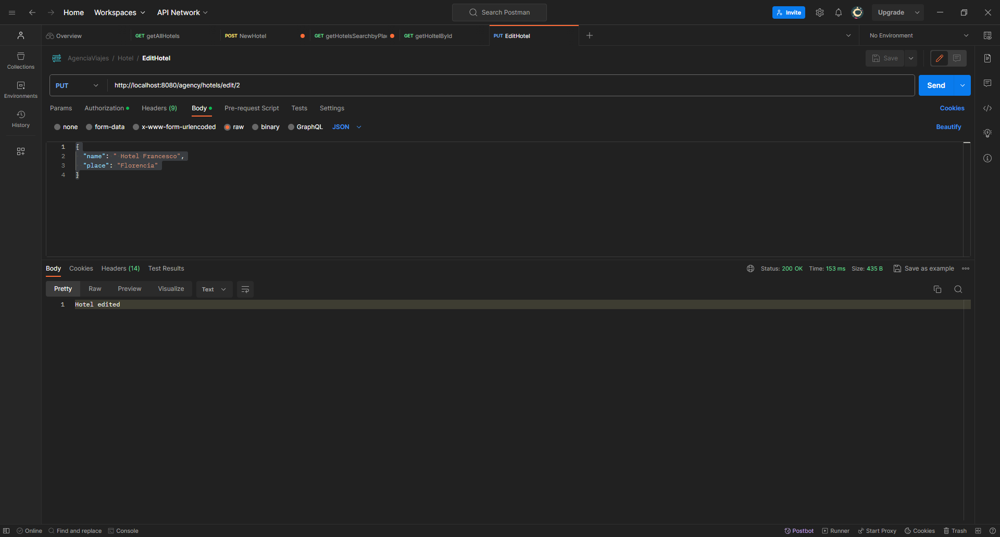


### Método DELETE
***

**Este método el empleado tiene que estar autenticado**

Este método es el encargado de hacer el borrado, en mi caso he optado por el borrado lógico, es decir, 
agregado 2 columnas más a dicha tabla en la cual una es una bandera, la cual me dice si está a 0 es que está activo
y si está a 1 es que está eliminado, a su ver tiene otra columna que dice la fecha del borrado.
Para eliminar el hotel se hace a través del ID.
Si el hotel tiene una reserva hecha evidentemente no podrás eliminar el hotel a no ser que hayas eliminado la reserva antes.

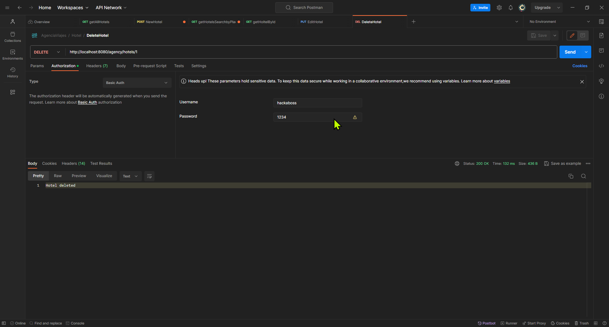

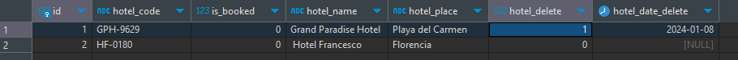

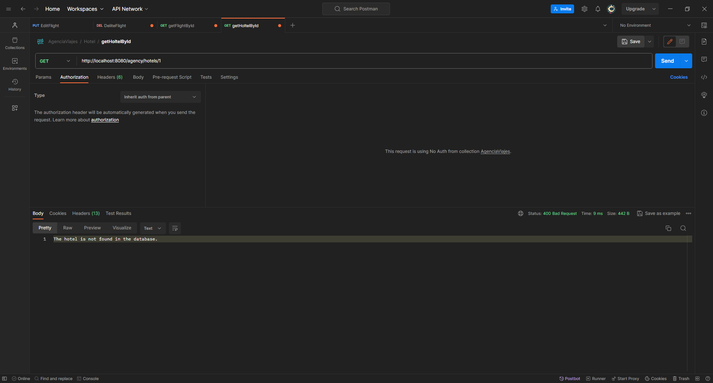


Si eliminamos el hotel, tampoco nos aparecerá en la los endpoint de listar los hoteles.

Si quieremos obtener por ejemplo el hotel por su id:


## Vuelos
****

Aquí los endPoints son muy muy parecidos, diferencia del hotel es el actualizar y el crear, ya que el actualizar
solamente uso las fechas y el origen y destino. Así que para no alargar mucho esta documentación a partir de este punto
solo pondré las imágenes que realmente cambien algo respecto a hoteles, ya que es muy similar y así no se hace redundante
para el desarrollador que tenga que leerla.

Aquí como hemos dicho anteriormente los vuelos de ida y otro de vuelta, es decir, que si la ida es un vuelo con un código
y la vuelta es otro vuelo con otro código diferente.

## EndPoints:

### Método POST (Creación de vuelo).
***

>http://localhost:8080/agency/flight/new

En este método es la creación del vuelo como tal, aquí simplemente lo que vamos a ingresar es un vuelo nuevo:

```json
{
    "origin": "Madrid",
    "destination": "Kyoto",
    "date": "2024-05-23"
}
```

En este caso agregamos un vuelo, entonces la respuesta es muy similar al del hotel:

>Successfully created flight

### Método GET (obtener la lista de todos los vuelos)
***

>http://localhost:8080/agency/flights

Con este método lo que vamos a obtener son todos los vuelos que tenemos en nuestra base de datos.

```json
[
  {
    "id": 1,
    "flightNumber": "MAKY-0391",
    "origin": "Madrid",
    "destination": "Kyoto",
    "date": "2024-05-23",
    "status": false,
    "updated": null
  },
  {
    "id": 2,
    "flightNumber": "BANU-9543",
    "origin": "Barcelona",
    "destination": "Nueva York",
    "date": "2024-03-15",
    "status": false,
    "updated": null
  }
]

```

### Método GET (obtener la lista de vuelos en función de fechas, lugar de destinos y origen)
***

>http://localhost:8080/agency/flights/search?date1=2024-03-15&date2=2024-04-12&origin=Barcelona&destination=Nueva York


En este método lo que vamos a obtener son los vuelos por un rango de fechas y por el lugar de origen y el lugar de destino. 
Es muy similar al método de hoteles.

Si tenemos un error también nos dará un error diciendo:

>There are no flights with these criteria in the database.

La respuesta si los datos ingresados son correctos es:

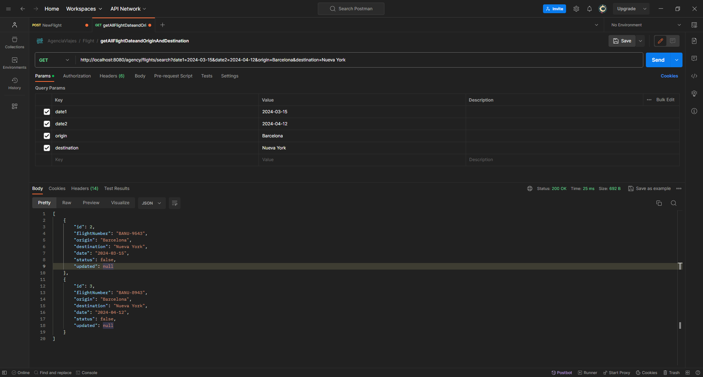

```json
[
    {
        "id": 2,
        "flightNumber": "BANU-9543",
        "origin": "Barcelona",
        "destination": "Nueva York",
        "date": "2024-03-15",
        "status": false,
        "updated": null
    },
    {
        "id": 3,
        "flightNumber": "BANU-8943",
        "origin": "Barcelona",
        "destination": "Nueva York",
        "date": "2024-04-12",
        "status": false,
        "updated": null
    }
]
```
### Método GET(método para obtener los vuelos por ID)
***

>http://localhost:8080/agency/flights/{id}

En este método lo que vamos a obtener son los vuelos por Id, es decir, muy similiar al método 
para obtener los hoteles por Id, en cambio al error que nos aparece es similar también :

>The flight is not found in the database.


### Método PUT(Método para actualizar los vuelos)
***

En este método lo que vamos hacer es actualizar los vuelos, en este caso lo que vamos a actualizar es:

```json
{
    "origin" : "Zúrich",
    "destination" : "Madrid",
    "date" : "2024-03-10"
}
```
La respuesta si los datos son correctos son :
>Flight updated

Este son los datos que queremos actualizar, comprobamos que en el origen y destino tenga solo letras:

```json
{
    "origin" : "Zúrich6",
    "destination" : "Madrid",
    "date" : "2024-03-10"
}
```
El error que nos saldrá es la siguiente:

>Flight origin and destination can only contain letters and cannot be empty

Aquí como modificamos el origen y el destino que es como obtenemos el código, también se cambiará el código del vuelo en la base de datos

### Método DELETE(Método para eliminar los vuelos)
***

En este método es para eliminar los vuelos y el funcionamiento es exactamente el mismo que en el hotel.
Aquí lo también hemos usado la eliminación lógica, la lógica en la base de datos es exactamente la misma que en hoteles.
Tendremos 2 columnas adicionales en la cual una es si está o no está eliminado y una fecha de baja.

Para poder borrar un vuelo es el empleado quien puede hacer la eliminación siempre y cuando esté autenticado

>http://localhost:8080/agency/flights/{id}

La respuesta que nos da es:

>Flight deleted

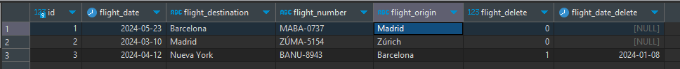

Y si ahora quisieramos obtener ese vuela a través del ID nos dirá:

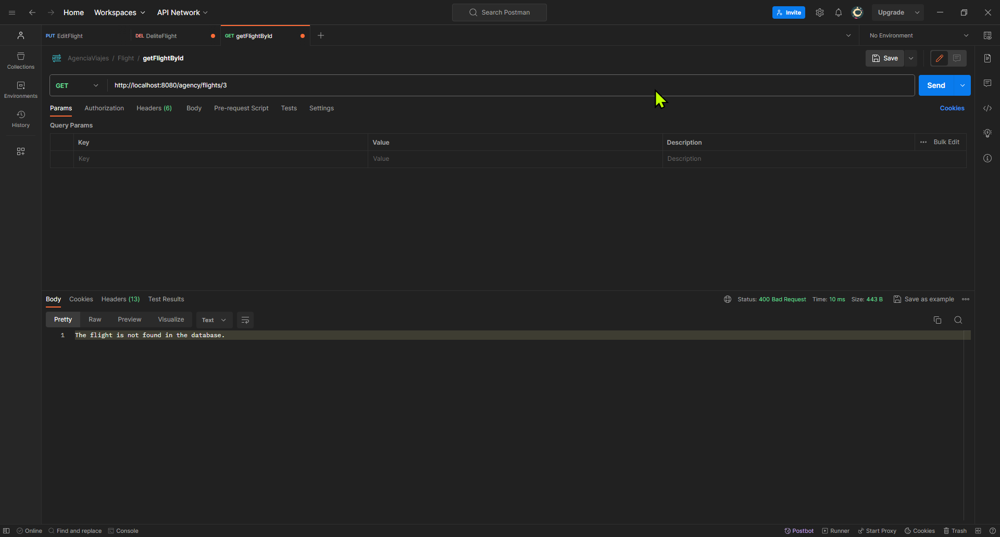

Teóricamente no existe de cara al usuario.


## Reserva de vuelos
****
En este caso vamos a ver como es el funcionamiento de la reserva de vuelos, la dinámica es muy similar a lo que hemos
ido viendo hasta ahora, esto qué quiere decir, pues que iré poniendo las imágenes que sean necesarias para no ir repitiendo 
lo anteriormente hecho.

En este caso los métodos de creación de la reserva no hará falta autenticarse como en los casos anteriores.

## EndPoints:


### Método POST (creación de la reserva)
***

Como he dicho anteriormente en los hoteles que creaba el hotel junto a la habitación, aquí pasa algo parecido, es decir, que
en este caso no será la creación de la habitación sino la creación del o los usuarios que realizan la reserva.

>http://localhost:8080/agency/flight-booking/new

Request:

```json
{
   "date": "2024-05-23",
   "origin": "Madrid",
   "destination": "Barcelona",
   "flightCode": "MABA-0737",
   "seatType": "Economy",
   "price": 50,
    "passengers": [
     {
      "name": "Miguel",
      "lastName": "Navarro Pérez",
      "email": "miguel@miguel.es",
      "passPort": "AB123456A",
      "age": 20
    }
    ]

}
```

Y si queremos hacer otra reserva con el mismo código de vuelo, pero con distintas personas se puede, pero usuarios que
ya tienen reservas no pueden hacer reservas de vuelos con los mismos datos

```json
{
   "date": "2024-05-23",
   "origin": "Madrid",
   "destination": "Barcelona",
   "flightCode": "MABA-0737",
   "seatType": "Business",
   "price": 150,
    "passengers": [
     {
      "name": "Alicia",
      "lastName": "Navarro Pérez",
      "email": "ali@ali.es",
      "passPort": "AB123456A",
      "age": 35
    }
    ]

}
```

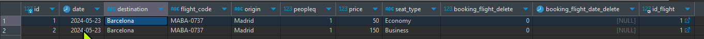

### Método GET (devuelve todas las reservas)
***

>http://localhost:8080/agency/flight-booking/all

En este caso para ver todas las reservas no las podrá ver el usuario, si no sólo las podrá ver el empleado autenticado
así evitaremos enseñar información de usuarios a otros usuarios.


La única diferencia respecto a los otros métodos get como de hoteles y de vuelos es esa, la autenticación.

Response:

```json
[
    {
        "id": 1,
        "date": "2024-05-23",
        "origin": "Madrid",
        "destination": "Barcelona",
        "flightCode": "MABA-0737",
        "peopleQ": 1,
        "seatType": "Economy",
        "price": 50.0,
        "passengers": [
            {
                "id": 4,
                "name": "Miguel",
                "lastName": "Navarro Pérez",
                "email": "miguel@miguel.es",
                "passPort": "AB123456A",
                "age": 20,
                "bookFlights": [
                    1
                ],
                "hotels": []
            }
        ],
        "flight": {
            "id": 1,
            "flightNumber": "MABA-0737",
            "origin": "Madrid",
            "destination": "Barcelona",
            "date": "2024-05-23",
            "status": false,
            "updated": null,
            "booked": false
        },
        "status": false,
        "updated": null
    },
    {
        "id": 2,
        "date": "2024-05-23",
        "origin": "Madrid",
        "destination": "Barcelona",
        "flightCode": "MABA-0737",
        "peopleQ": 1,
        "seatType": "Business",
        "price": 150.0,
        "passengers": [
            {
                "id": 5,
                "name": "Alicia",
                "lastName": "Navarro Pérez",
                "email": "ali@ali.es",
                "passPort": "AB123456A",
                "age": 35,
                "bookFlights": [
                    2
                ],
                "hotels": []
            }
        ],
        "flight": {
            "id": 1,
            "flightNumber": "MABA-0737",
            "origin": "Madrid",
            "destination": "Barcelona",
            "date": "2024-05-23",
            "status": false,
            "updated": null,
            "booked": false
        },
        "status": false,
        "updated": null
    }
]
```

Si en el hipotético caso de que la reserva haya sido eliminada no saldrá un error de:

>There are no available booked flights in the database.


### Método GET (este método nos devuelve la reserva por ID)
***

>http://localhost:8080/agency/flight-booking/get/{id}

En este caso vamos a buscar una reserva que al empleado le interese, en este caso será a través del ID

Así podremos obtener la reserva en la que estamos interesados y si en caso de que no exista la reserva, nos saltará un error:

Response:
>The booked flight reservation does not exist

### Método PUT (método para actualizar a través del ID)
***

En este método lo que vamos a hacer como hemos hecho en los otros caso(Vuelos y Hoteles), es actualizar los vuelos a través del ID que nosotros
le indiquemos

En nuestro caso vamos a actualizar el tipo de asiento, y de ahí cambiar 100 € de más o de menos el precio de la reserva.


Tabla sin actualizar:

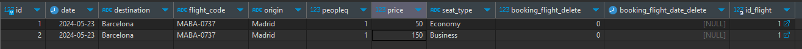

Ahora vamos a mostrar la tabla actualizada:

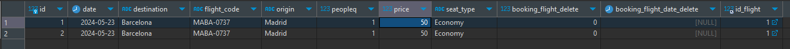

En este caso com hemos comentado anteriormente se actualiza el tipo de asiento y automáticamente 
se actualiza también el precio.

Request:
```json
{
  "seatType": "Economy"
}
```

### Método DELETE (método para eliminar un vuelo)
***

Este método es muy similar a todos los métodos de borrado de las anteriores clases(Hoteles y vuelos). 
Buscamos el vuelo por el id correspondiente y eliminamos la reserva:

Para poder eliminar una reserva el empleado tiene que tener las acreditaciones.

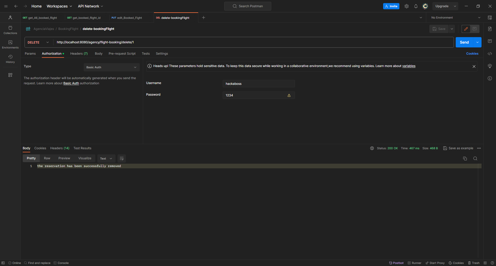

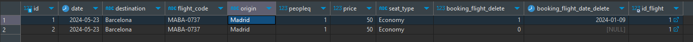


## Reserva de Hoteles
***


En esta clase vamos a ver que los endPoints soy muy similares a los endPoints de la reserva de vuelos, a diferencia
que en Hoteles cuando eliminemos, la reserva quedará libre y así poder hacer otra reserva con ese mismo código de hotel.

## EndPoints:

### Método POST (método para crear una reserva)
***

En este caso como ocurre en el _POST_ de la reserva de vuelos, aquí aparte de crear los hoteles, también crearemos a los usuarios
y si ya están creados no los volverá a crear.

Para crear la reserva tendremos que agregar el código correcto del hotel o lo hemos eliminado(eliminado lógico), en caso contrario, nos dará un error de:

> The hotel does not exist in the database

Si por ejemplo la ciudad no coincide con la ciudad del código del hotel nos dará el siguiente error:

> The hotel does not correspond to the city

También si agregamos una habitación que no coincida con la habitación del hotel, nos dará el siguiente error:

> The specific room for the reservation was not found.

Y si la habitación es por ejemplo una _individual_ y agregamos a dos personas no dará el siguiente error:

> The individual room allows a maximum of 1 people.

En este caso sólo tendremos 3 tipos de habitaciones:

1. Individual
2. Doble
3. Triple

También tendremos errores en los usuarios:

1. El nombre y apellidos de los usuarios sólo se permite letras
2. El email,tiene que tener el siguiente formato: pepito@example.com o pepito@example.es, etc
3. El pasaporte tiene que ser alfanumérico
4. La edad no puede ser ni 0, ni tampoco negativo


Request:

```json
{
  "dateFrom": "2024-02-21",
  "dateTo": "2024-02-25",
  "place": "Florencia",
  "hotelCode": "HF-0180",
  "roomType": "Triple",
  "hosts": [
    {
      "name": "Miguel",
      "lastName": "Pérez Ordoñez",
      "email": "migue@miguel.es",
      "passPort": "AB123456A",
      "age": 25
    },
    {
      "name": "Carlos",
      "lastName": "Jimenez Jimenez",
      "email": "carlitos@carlitos.es",
      "passPort": "AB123456A",
      "age": 24
    }
  ]
}
```
La respuesta que nos debe de salir, como dice en el enunciado es el total del precio por noches:

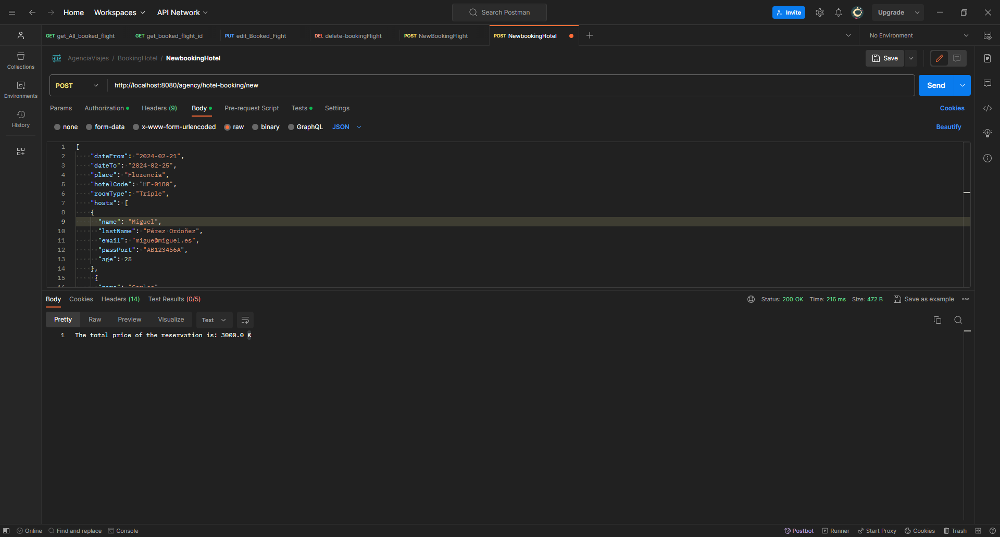

### Método GET (Obtener las reservas por el ID)
***

Este método es muy similar por no decir idéntico al de reserva de vuelos, la única diferencia es que este se llama hoteles
(Un pequeño chiste). La respuesta es igual como he dicho anteriormente y también es por id, esta tiene que estar autentica el 
empleado para poder ver dicha reserva:

Response: 

```json
{
    "id": 1,
    "hotelCode": "HF-0180",
    "dateFrom": "2024-02-21",
    "dateTo": "2024-02-25",
    "nights": 4,
    "peopleQ": 2,
    "price": 3000.0,
    "roomType": "Triple",
    "users": [
        {
            "id": 2,
            "name": "Miguel",
            "lastName": "Pérez Ordoñez",
            "email": "migue@miguel.es",
            "passPort": "AB123456A",
            "age": 25,
            "bookFlights": [],
            "hotels": [
                1
            ]
        },
        {
            "id": 6,
            "name": "Carlos",
            "lastName": "Jimenez Jimenez",
            "email": "carlitos@carlitos.es",
            "passPort": "AB123456A",
            "age": 24,
            "bookFlights": [],
            "hotels": [
                1
            ]
        }
    ],
    "hotel": {
        "id": 2,
        "hotelCode": "HF-0180",
        "name": " Hotel Francesco",
        "place": "Florencia",
        "status": false,
        "updated": null,
        "room": {
            "id": 2,
            "roomType": "Triple",
            "roomPrice": 750.0,
            "disponibilityDateFrom": "2024-02-20",
            "disponibilityDateTo": "2024-03-25"
        },
        "booked": true
    },
    "status": false,
    "updated": null
}
```

Si la reserva no existe o está eliminada nos saltará el siguien error:

> The hotel reservation does not exist


## Método GET (Obtener todas las reservas)
***

Aquí como en la reserva de vuelos, nos devuelve todas las reserva, como en este caso sólo tenemos una sóla reserva
pues nos va a devolver el mismo resultado que el devolver por ID. Pero en el caso de que tengamos más de una, pues nos va a
devolver todas las que en ese momento se encuentre en nuestra base de datos, siempre y cuando no estén eliminadas.


## Método PUT (Actualizar la reserva por ID)
***

En este caso vamos a actualizar las reserva, es muy parecido a actualizar los vuelos, con la salvedad de que vamos a actualizar

las fechas, al actualizar las fechas también se actualizarán solas las noches y en su defecto también se actualizará el precio por noche, devolviendo 
una leyenda para saber lo que tenemos o no que devolver.

Request: 
```json
{
  "dateFrom": "2024-10-12",
  "dateTo": "2024-11-18"
}
```

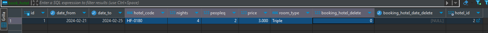

Si queremos actualizar un hotel con fechas que no están en el rango de la habitación, éste nos dará un error:

>The reservation dates are not within the room's availability range or are not valid. The dates are:
>- From: 2024-10-12
>- To: 2024-11-18
>- The dates you want to change are:
>- From: 2024-02-21
>- To: 2024-02-25


Request postman: 

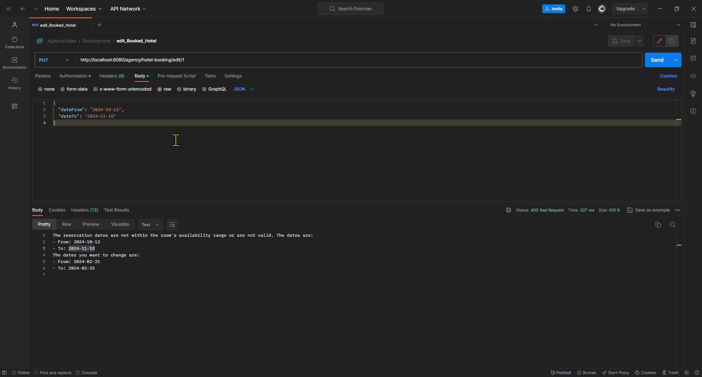

Request postman (status: OK)

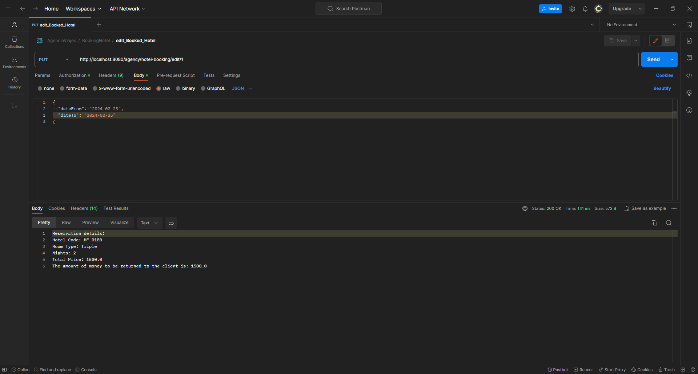

Base de datos actualizada:

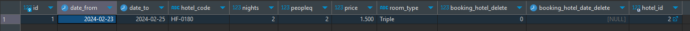


### Método DELETE (Eliminar reserva)
***

Como llevo diciendo en toda la documentación, este método es muy parecido al método de borrado de las
clases (Hotel, Reserva de vuelos y Vuelos), con la única salvedad que en este caso si eliminamos la reserva se nos tiene que
habilitar otra vez la posibilidad de poder hacer otra reserva en la misma habitación (si está reservada no se podrá realizar la reserva)


Eliminacón de la reserva:

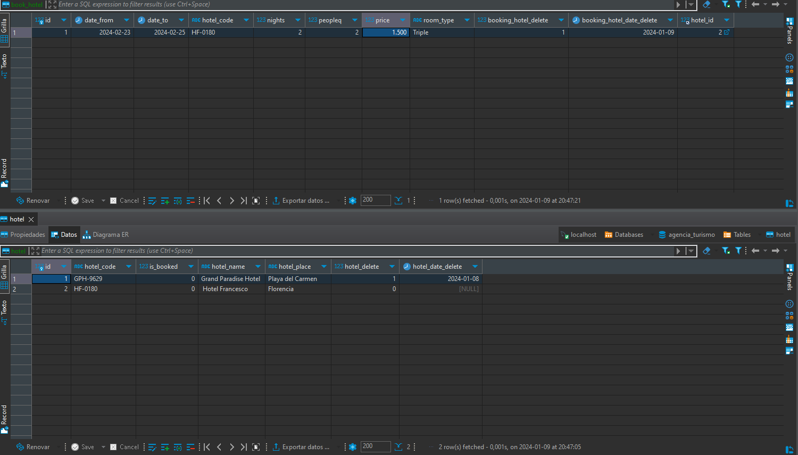

Y si ahora quisieramos crear otra reserva en esa misma habitación podríamos porque ha quedado libre:


## Posibles mejoras para los siguientes SPRINTS
***

1. Una de las posibles mejoras es la de que no haga falta crear un hotel por cada habitación, es decir, crear un hotel y aparte una habitación y que
   cada hotel tenga una lista de habitaciones en la cual se pueda elegir que habitación quieres y que sea la habitación que controle las reservas.

2. Otra posible mejora es controlar que los usuarios no tengan el mismo pasaporte, ya que es como el DNI, sería intransferible y así tener un mayor control
   sobre lois usuarios.
